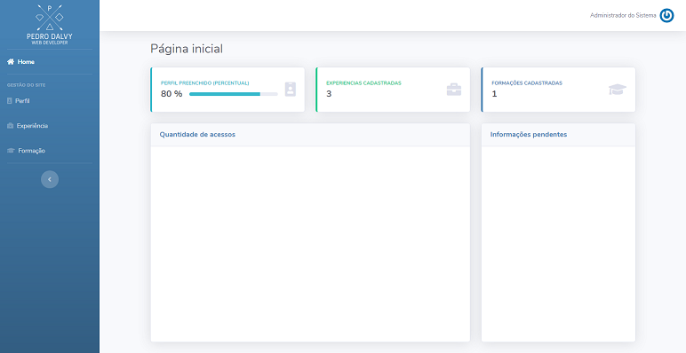

## Descrição do projeto

Dashboard criado para gerenciar o site https://www.pedrodalvy.com. É possível adicionar informações como Perfil, Experiências e Formações, da mesma forma que é preenchido um currículo padrão.

### Preview da tela inicial (incompleta)



### Requisitos

* PHP 7.2.5 ou superior
* Banco de Dados (ex: MySQL, PostgreSQL, SQLite)
* Servidor Web (ex: Apache, Nginx, IIS)
  

### Framework

O dashboard utliza o [Laravel](http://laravel.com), framework PHP, versão 7.2 e o [Bootstrap 4](https://getbootstrap.com/) para front-end.


### Instalação do projeto

* Necessário o [Composer](https://getcomposer.org/download)
* Clonar o repositório: `git clone https://github.com/pedrodalvy/dashboard.git`
* Após clonar, acessar a pasta do projeto: `cd dashboard`
* Instalar as dependências: `composer install`
* Gerar a migration com dados de exemplo: `php artisan migrate --seed`


### Utilização

Após gerar as seeds, o usuário padrão é admin e a senha também é admin, porém a tela inicial ainda não foi finalizada.


### Utilização da API

É possível utilizar a API para visualizar todos os dados cadastrados no sistema em formato Json e integrá-lo com outro sistema.

* Opcionalmente, executoar o servidor embutido do php: `php artisan serve`
* Acessar a rota: `http://localhost:8000/api/v1/resume-info/1` para obter o retorno com os dados cadastrados.

O número 1 no final da url representa o id do perfil. Atualmente o sistema só suporta um perfil, posteriormente será modificado para adição de mais usuários.

### Retorno da API

```json
{
   "education":[
      {
         "id":1,
         "course":"Communication Equipment Worker",
         "establishment":"Powlowski-Crist",
         "course_resume":"Eos omnis corrupti qui eum ea. Officiis qui maiores qui nostrum sunt tenetur non. Placeat eligendi nostrum voluptatem ea.",
         "date_in":"1970-05-09",
         "date_out":"2012-07-15",
         "created_at":"2020-05-02T20:27:14.000000Z",
         "updated_at":"2020-05-02T20:27:14.000000Z"
      },
      {
         "id":2,
         "course":"Product Management Leader",
         "establishment":"Schumm, Beer and Predovic",
         "course_resume":"Rerum et minima ea expedita et quo. Architecto voluptatem ut qui mollitia. Voluptatem optio qui voluptas in. Quis molestiae ut veniam ab asperiores.",
         "date_in":"1994-09-14",
         "date_out":"2015-05-25",
         "created_at":"2020-05-02T20:27:14.000000Z",
         "updated_at":"2020-05-02T20:27:14.000000Z"
      },
      {
         "id":3,
         "course":"Waiter",
         "establishment":"Balistreri, Orn and Toy",
         "course_resume":"Voluptates voluptatum ut soluta molestiae sed. Ut dolorem et debitis est ut fuga. Quos odio a qui omnis corporis recusandae et. Qui et aut eaque architecto molestiae qui quia.",
         "date_in":"1976-09-01",
         "date_out":"1979-03-30",
         "created_at":"2020-05-02T20:27:14.000000Z",
         "updated_at":"2020-05-02T20:27:14.000000Z"
      }
   ],
   "experience":[
      {
         "id":1,
         "job_title":"Pharmaceutical Sales Representative",
         "company":"Hand, Ondricka and Corkery",
         "job_resume":"Minima sunt facilis sed quam. Tenetur rerum quis dolorem excepturi ut. Doloremque laboriosam exercitationem repudiandae quas placeat nostrum. Et velit aspernatur quae.",
         "date_in":"1974-08-09",
         "date_out":"1992-06-27",
         "created_at":"2020-05-02T20:27:14.000000Z",
         "updated_at":"2020-05-02T20:27:14.000000Z"
      },
      {
         "id":2,
         "job_title":"Illustrator",
         "company":"Berge-Ullrich",
         "job_resume":"Sed rem ad nisi architecto. Qui mollitia eveniet non autem et aliquid voluptatibus. Iure placeat assumenda quia quisquam. Dolore distinctio repellat exercitationem qui nesciunt.",
         "date_in":"1985-02-13",
         "date_out":"1999-04-25",
         "created_at":"2020-05-02T20:27:14.000000Z",
         "updated_at":"2020-05-02T20:27:14.000000Z"
      },
      {
         "id":3,
         "job_title":"Art Director",
         "company":"Reinger-Terry",
         "job_resume":"Corporis corrupti vel voluptatem qui. Natus quasi est porro velit impedit. Quis fuga qui esse quasi eveniet quia cumque. Sit et eos dolore eveniet aut similique.",
         "date_in":"1970-05-15",
         "date_out":"2003-06-03",
         "created_at":"2020-05-02T20:27:14.000000Z",
         "updated_at":"2020-05-02T20:27:14.000000Z"
      }
   ],
   "profile":{
      "id":1,
      "name":"Sadye Farrell",
      "description":"Dolor modi quo consequuntur non doloremque est. Quo nihil dolor dicta iusto est. Id ipsum corporis laudantium quo.",
      "resume":null,
      "created_at":"2020-05-02T20:27:14.000000Z",
      "updated_at":"2020-05-02T20:27:14.000000Z",
      "email":"dean97@hotmail.com",
      "fone":"(99) 9 9999-9999",
      "address":"Centro, Campo Grande\/MS - Brasil",
      "function":"Desenvolvedor Full-Stack",
      "pricing":"3000.00",
      "linkedin":null,
      "github":null,
      "site":null,
      "skills":"PHP,HTML,CSS,JavaScript"
   },
   "url_cv":{
      "cv_link":null
   }
}
```